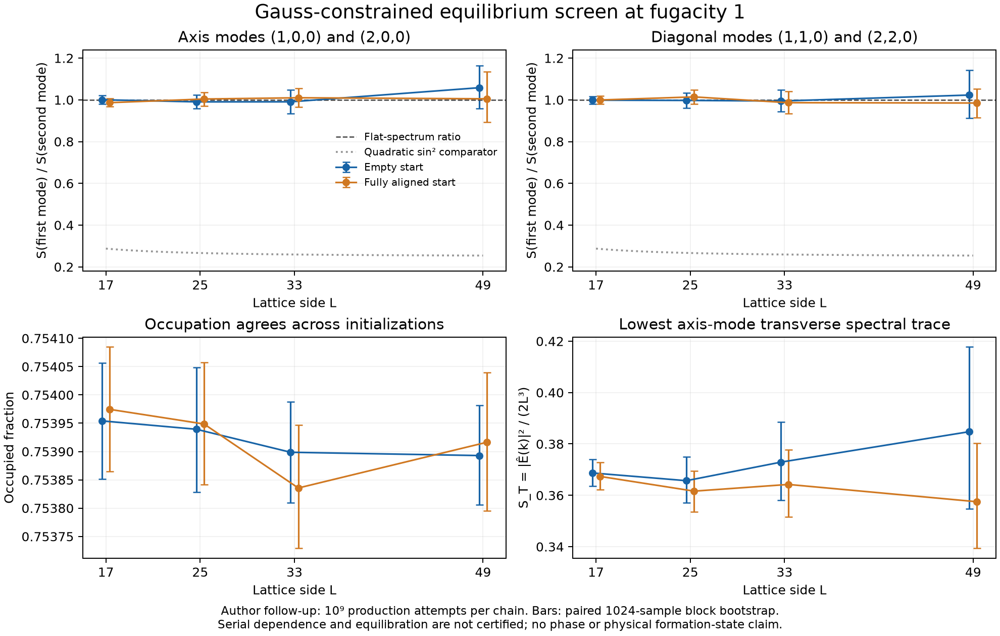

# Constrained-record equilibrium screens and global/local covariance

2026-09-21. Provisional numerical evidence, with independently checked sampler
mathematics and selective data verification. This report does not establish
a thermodynamic phase or the state selected by permanent record formation.

The fugacity-one constrained ensemble is worth further investigation. Its
low-wave-number spectrum stays approximately flat through side length 49,
from both empty and fully aligned starts. An adaptive comparison of winding
variance and local spectral amplitude gives ratios near one. These are
classical constrained-field diagnostics. Several long-block series remain
dependent, the largest boxes have only 16 or 17 blocks, and the higher
fugacity screen contains severe trapping. Those limitations remain part of
the result, not discarded cases.

## Ensemble and what was actually simulated

The site menu is vacancy and the six signed coordinate-axis vectors E.
Each site has capacity one and D2.E=0, with centered lattice divergence.
The target finite-volume law is pi_z(E) proportional z^n(E) on constrained
fields. This is the z_B=0 single-species restriction of the earlier loop
ensemble. No B labels are sampled.

An auxiliary worm sampler creates/removes these fields. Its extended
constraint is D2.E=delta_tail-delta_head; symmetric head proposals use
Metropolis min(1,z^Delta_n), with endpoint relocation at closed states.
The closed-state trace includes all visits, including rejection holds.
The finite stationary law and accessibility have exact proofs, but no
quantitative mixing bound. This sampler is not the physical immutable-record
process: its removals and creations are equilibrium sampling devices.

The first screen covered L=9,13,17, z=.2,1,4, and empty/full-aligned starts:
18 cases, each with 5 million burn-in and 25 million production attempts.
The adaptive z=1 follow-up covered L=17,25,33,49 and both starts: eight cases,
each with 100 million burn-in and one billion production attempts. All cases
were retained. No forced worm closure, length cutoff or discarded restart
was used. Production can end open, as disclosed in each metadata file.

Integer divergence, occupancy and signed contents were checked from the
field at each recorded closed state. The four recorded nonzero momenta are
the first and second axis modes and the first and second diagonal modes.
S_T is |Ehat(k)|^2/(2L^3); exact divergence makes this the average transverse
spectral power. The full raw CSVs contain observables, not field snapshots.

## Results that guide the next decision

At z=.2 all six screen cases have only thirteen complete 128-visit blocks,
below the declared interval-reporting threshold. The axis spectral ratio
decreases from roughly .55-.58 at L9 to .34-.37 at L17. No interval or
asymptotic exponent is claimed. This fugacity lies outside the earlier
rigorous dilute-polymer bound, so this screen cannot be called a numerical
verification of that theorem's domain.

At z=4 the fully aligned L13 and L17 runs retain constant saved observables
over 18,734,892 and 18,743,677 visits. Their measured density is one, while
the corresponding empty starts give approximately .919 and .912. The L9
full start also has a very long identical-observable run and a different
density from the empty start. Millions of repeated visits are not evidence
of equilibrium. The spectral ratios for these cases do not support a phase
inference.

At z=1 the longer runs give density .75384-.75398 across starts and sizes.
The following estimates use complete 1024-visit blocks. Intervals are
descriptive paired-block bootstrap intervals, not certified confidence
coverage. Axis and diagonal mean S(k_min)/S(2k_min).

| L | Start | Blocks | Axis ratio | Diagonal ratio |
|---|---|---:|---|---|
|17|empty|392|1.000 [0.981, 1.022]|0.998 [0.980, 1.017]|
|17|aligned|382|0.987 [0.967, 1.006]|0.999 [0.981, 1.019]|
|25|empty|123|0.990 [0.959, 1.024]|0.997 [0.962, 1.032]|
|25|aligned|123|1.004 [0.971, 1.036]|1.014 [0.981, 1.049]|
|33|empty|52|0.990 [0.933, 1.049]|0.994 [0.944, 1.048]|
|33|aligned|54|1.010 [0.966, 1.054]|0.986 [0.933, 1.042]|
|49|empty|17|1.058 [0.958, 1.164]|1.023 [0.912, 1.143]|
|49|aligned|16|1.005 [0.892, 1.136]|0.985 [0.914, 1.054]|

All sixteen displayed intervals contain one. This is descriptive finite-size
flatness, not proof of a constant infrared limit. The lowest axis-mode
amplitudes remain around .36-.38 rather than displaying a resolved quadratic
collapse over these boxes. Winding changes occur, but neither those changes
nor agreement between starts certifies mixing. Long-block lag dependence is
flagged in L25 aligned, L33 empty and both L49 profiles. L49 empty's density
block lag correlation is about .451.

The figure's dotted quadratic reference uses the centered-stencil ratio
1/[4 cos^2(2pi/L)]. It is a reference shape, not a fitted competing model.
Both 128- and 1024-visit analyses, half-run comparisons, tails, metadata,
seeds and all flags remain in `FOLLOWUP_ANALYSIS.json`.

## Adaptive winding-versus-spectrum diagnostic

A separately stated classical quadratic constrained-field benchmark predicts
both S_T(k)=1/K and <F_i^2>/V=1/K, where F_i=sum_x E_i(x) and V=L^3.
Thus G/S=1, for G=<|F|^2>/(3V) and S the four-mode average. The premise is
an added effective Gaussian description; it is not derived for this model.
The finite grand ensemble has zero mean by inversion, so uncentered second
moments were specified before this analysis. Sample means are retained as
diagnostics and were not silently subtracted.

All eight raw files were reread and rehashed against their earlier identities
(150,150,494 bytes). New 1024-visit block reductions reproduce the earlier
four-mode reductions. Paired resampling keeps global and local values from
the same block together and keeps the two initializations separate.

| L | Start | G/S | Descriptive interval |
|---|---|---:|---|
|17|empty|0.9833|[0.9673, 0.9997]|
|17|aligned|0.9939|[0.9769, 1.0101]|
|25|empty|1.0114|[0.9781, 1.0423]|
|25|aligned|1.0180|[0.9868, 1.0500]|
|33|empty|0.9794|[0.9256, 1.0331]|
|33|aligned|1.0037|[0.9596, 1.0466]|
|49|empty|0.9601|[0.9093, 1.0150]|
|49|aligned|1.0057|[0.9330, 1.0756]|

Seven intervals contain one; the L17 empty interval narrowly excludes it.
That discrepancy is retained. These dependent, adaptive, multiple diagnostics
do not define a formal hypothesis test. The benchmark's integer-winding
Gaussian correction is below displayed precision for the observed L and S.
This does not bound finite-size corrections of the actual record model.
At L49 the individual directional winding variances vary materially, and
the sample flux means are not zero. Full values and half-run comparisons
are in `winding_analysis/WINDING_ANALYSIS.json`.

This diagnostic was derived and executed by the primary author after the
sampler review. A separate subsequent check independently reconstructed the
Gaussian benchmark, compact arithmetic, seeded paired bootstrap and selected
first/last raw blocks. Its report is `winding_stiffness_independent/REPORT.md`
(SHA 995d1112235f7c4cc253d06a915c300785f1a2c6f0fde1c2aad417b99edf99e9).
It did not rerun production or rehash every raw input; its coverage remains
distinct from the earlier sampler review. The Gaussian winding-quantization
correction is bounded below 1.011e-51 at these inputs, so that benchmark
correction cannot account for a percent-scale discrepancy.

## Classical structure is not a quantum-vacuum result

The distinction is established in the quantum-spin-ice literature: classical
divergence-free correlations have a transverse projector with approximately
constant amplitude, while the photon ground state has an additional |k|
factor; thermal occupation restores a constant low-k amplitude. See Benton,
Sikora and Shannon, equations (2), (9) and (121),
[arXiv:1204.1325v2](https://arxiv.org/pdf/1204.1325v2). Those equations and the
surrounding explanatory text were checked; no equivalence between their
diamond-lattice quantum model and this record ensemble is asserted.

Consequently a flat finite-box record spectrum is an encouraging classical
correlation diagnostic. It supplies neither canonical quantum commutators
nor a vacuum state. It also does not show that the physical formation process
selects this grand ensemble: empty local loop formation can be confined to
different winding and count sectors.

## Independent check, source identity and next discriminators

The independent reconstruction used a square charge cycle with 36 extended
states, different from the author's three-site ring. It reproduced the exact
closed-trace law and showed that deleting self visits changes the stationary
weights. The full sampler sources and analysis codes were read; all 26 compact
reductions and selected raw prefixes/tails agree. That review did not rerun
production, regenerate bootstrap intervals or rehash all 5.30 GB of raw data.

Report: `gauss_sampler_independent/REPORT.md`, SHA
2e23630a501e17b7c31f5dca06c1f3b788781778855c297bc7eed7e921f076fd.
Final seal: f784d85cf1cb5b7eb0986c043564f157ce477a24755e814aeecc57668e6c33f6.
The root verification receipt authenticates 136 sources, three procedure
dependencies and thirteen artifacts. The exact scope is in that report.
The earlier undefined-lag/NaN analysis attempt and its narrow correction
remain preserved; no case or unfavorable result was removed.

Further useful work would obtain enough independently started effective
samples at large sizes, measure the full angular covariance and parity-sector
structure, and test the measure actually reached by a specified physical
record process. A proof of a nonanalytic transverse infrared covariance
would be consequential. Neither more nominal worm attempts nor fitting
an exponent to these four sizes substitutes for those obligations.
