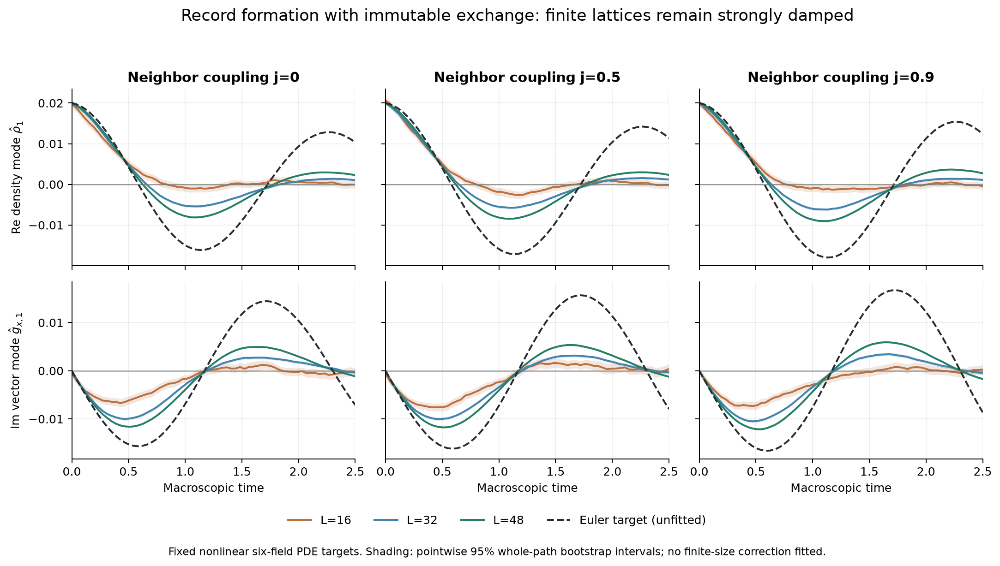
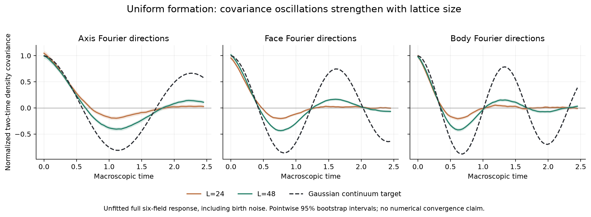

# Native formation wave screen: completed comparison and its limits

2026-09-21. All nine planned simulations completed. This is numerical evidence
for the declared classical model, not a convergence proof or a physical fit.
The simulator, calibration, fixed plan, raw paths and nonlinear targets are
preserved beside this report; source identities are in their JSON manifests.

The screen uses the axis-balanced immutable exchange with alpha=.5 and
positive floor .05, six-neighbor birth weights1+j v_a.v_neighbor, and
per-label microscopic birth beta/N with beta=.04. Initial density is
.5+.04 cos(2pi x/N), with equally probable directions at each site.
The three couplings j=0,.5,.9 are each run on side16,32,48 cubes. The first
two sizes use128 complete paths per case; side48 uses96. There are65 sample
times through macroscopic t=2.5, four Fourier modes and all six fields.
These parameters and seeds were fixed before the results.

The frozen target solves the complete six-species nonlinear reaction-current
PDE, using spectral spatial derivatives and DOP853. The retained low modes
agree between grids128 and256 to at most1.67e-13 on the checked interval;
this numerical control is not a smooth-PDE existence proof. Replacing that
target by a linear response already changes the first-mode amplitude by up
to.0007 at j=.9, so all comparisons retain the nonlinear target. No damping
or speed coefficient is fitted to these native-birth data.

Before the screen, a separately assembled2401-state four-cycle generator
was compared with8192 simulator paths for four controls including negative
coupling, inhomogeneous profiles, means, powers and two-time covariances.
All1048 comparisons per case lay within the declared5.5-standard-error
screen. This is a calibration screen, not simultaneous confidence coverage.

## The first oscillation is present but strongly damped

At the density target's preselected first minimum, t=1.1328125:

| j | Euler target | Side16 mean | Side32 mean | Side48 mean (pointwise95% interval) |
|---|---:|---:|---:|---:|
| 0 | -.0161510 | -.0009281 | -.0054005 | -.0080660 [-.0082674,-.0078581] |
| .5 | -.0171511 | -.0025100 | -.0057460 | -.0084174 [-.0085953,-.0082346] |
| .9 | -.0179965 | -.0010821 | -.0061935 | -.0090202 [-.0092770,-.0087640] |

The joint density/longitudinal-vector first-mode RMS discrepancies are:

| j | Side16 | Side32 | Side48 |
|---|---:|---:|---:|
| 0 | .0087650 | .0068573 | .0054952 |
| .5 | .0089043 | .0073868 | .0060555 |
| .9 | .0099107 | .0078692 | .0063004 |

These three-size trends are consistent with approach toward the Euler target,
but finite-size discrepancies remain much larger than sampling uncertainty.
There is no basis here for a numerical convergence exponent or an accurate
finite-size error model. All65 times, four modes and six field means and
pointwise intervals are available in the analysis archives. The displayed
figure was generated from those archives without refitting.

## Quadrupole generation is not resolved by this sample

The continuum reaction predicts a small global q_x-q_y increment, ending
at.00006941 for j=.5 and.00024582 for j=.9. The raw final means include
random initial imbalances. An explicitly **post-screen exploratory** analysis
subtracts each path's own initial quadrupole and retains every case. For
side48 the resulting increments and pointwise95% bootstrap intervals are:

| j | Paired increment | Interval | Target increment |
|---|---:|---:|---:|
| 0 | -.00008129 | [-.00031196,.00014148] | 0 |
| .5 | .00002826 | [-.00022109,.00028448] | .00006941 |
| .9 | .00008477 | [-.00013960,.00030376] | .00024582 |

Every paired interval in all nine cases includes zero. This does not
establish the predicted quadrupole signal. For j=0, the per-path variance
of that increment has the exact conditional birth-label benchmark
(2/3) E[births]/volume^2; at side48 the predicted1.36089e-6 and observed
1.32867e-6 are consistent in scale. The paired analysis does not replace
the original unpaired comparisons or change any target.

## Uniform formation covariance benchmark

The separate axis-balanced uniform-birth screen has512 trajectories at
sides24 and48. The full growing-product fluctuation theorem supplies an
unfitted six-field covariance target including formation noise. At the
axial target's first density minimum the side24 covariance is-.19253,
side48 is-.40291 (95% interval[-.43768,-.36850]), and the continuum target
is-.81296. Final vacancy at side48 is.27772699 with estimated sampling
SE.00006027, versus exact.27775254. The density law is well resolved while
the propagating covariance still has substantial finite-size damping.

Uncertainty throughout:4000 complete-path bootstrap resamples, symmetry
modes averaged within a path where applicable. Intervals are pointwise and
describe Monte Carlo sampling, not finite-size bias, PDE discretization,
multiplicity-adjusted coverage or uncertainty in a physical model.

## Reproduction and source records

- `ADMISSIBILITY_WAVE_SCREEN_PLAN.md`, `admissibility_wave_screen/PLAN.json`:
  fixed parameters and seeds; `COMPLETED_CASES.json` binds all raw files.
- `admissibility_wave_sim.py`, `calibrate_admissibility_waves.py`, calibration
  JSON/log: independently assembled finite-state comparison.
- `admissibility_wave_continuum.py`, target JSON/NPZ: frozen nonlinear targets.
- `analyze_admissibility_waves.py`, `CONTINUUM_ANALYSIS.json`: original complete
  field comparisons; failed first metadata-key lookup is preserved.
- `analyze_native_birth_increments.py`, `NATIVE_BIRTH_INCREMENT_ANALYSIS.json`:
  labeled exploratory paired increments, with all cases retained.
- `plot_native_formation_results.py`, `figures/NATIVE_FORMATION_FIGURE_PROVENANCE.json`:
  exact plotting inputs and rendered PNG/PDF identities. All three rendered
  figures were inspected; overlapping initial axis labels were shortened.

The separate third-order centering plot concerns a symmetric-stirring Taylor
response, not these driven simulations. Its coefficients must not be used
as a fitted correction for this screen without a new derivation.
