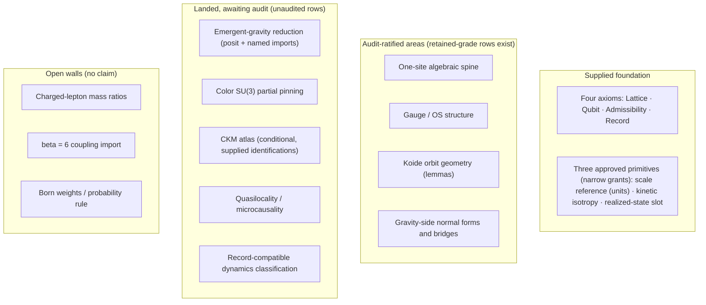

# State of the Theory — 2026-07-16

**Class:** F orientation memo (no premise or interpretive weight), registered in
[`docs/audit/data/doc_authority_registry.json`](../audit/data/doc_authority_registry.json).
This memo is citable for orientation and scope discipline only.
**Status discipline:** every status word in this memo was read from the audit
ledger's 2026-07-17 nightly state and goes stale from that moment. The live authorities are
the tracked ledger shards ([`docs/audit/data/ledger/`](../audit/data/ledger/)),
the generated [`RETAINED_BACKBONE.md`](RETAINED_BACKBONE.md), and
[`FRONT_DOOR_STATUS.md`](FRONT_DOOR_STATUS.md). Where this memo and the ledger
disagree, the ledger is right. This memo sets no audit verdict and promotes
nothing.

## What this program is

This repository is a falsification-first experiment in theoretical physics. The
question it asks is narrow and testable: **how much of known physics is forced
by four discrete axioms** — a cubic lattice of sites (**Lattice**), a one-site
possibility algebra `M_2(C)` / `Cl(3,0)` (**Qubit**), one covariant
nearest-neighbor availability rule (**Admissibility**), and permanent one-per-site
records as the only readable content (**Record**) — plus three narrow approved
primitives (a units-only scale reference, structural kinetic isotropy
`c_t = c_s`, and a realized-state interface that supplies no state selection)?

The repository is the experiment, not just its write-up. Claims land through
adversarial review — most carrying machine-checked runners that re-prove
their mathematics, though the repository also holds conditional,
import-bearing, and standalone mathematical rows without runners — and only
the **independent audit lane** assigns the status words that count. Nothing
an author writes — including this memo — grants a claim any standing.

Two consequences of that discipline shape everything below:

1. **The foundation was deliberately reset on 2026-06-29** from a three-axiom
   base to the current four-axiom base. The reset invalidated every audit that
   rested directly on the old axiom text. Ratification is being re-earned row
   by row; the audit lane, not the authors' confidence, sets the pace.
2. **Landing is not ratification.** Most of the program's newest and most
   ambitious chains are landed through review but not yet audited; this memo
   always says which of the two applies.

## How to read a status word

- **retained / retained_bounded / retained_no_go** — ratified by the
  independent audit lane; the only retained grades. A bounded row is an
  audited scope-bounded theorem: ratified with the boundary its note states
  (a declared scope; some rows additionally carry named supplied inputs).
- **unaudited** — landed through review, awaiting the audit lane. This is the
  current home of most flagship chains.
- **audited_conditional / audited_failed / audited_renaming /
  audited_numerical_match** — audited and not ratified as stated; these rows
  re-enter the repair or re-audit queue.
- Counts for all of these, refreshed nightly, live in
  [`FRONT_DOOR_STATUS.md`](FRONT_DOOR_STATUS.md).

As of the 2026-07-17 nightly ledger state, the ledger holds **3,767 rows**, of
which **392 are retained-grade** (76 retained positive rows, 302 retained
bounded rows, 0 retained no-go rows, 14 boxed decorations) and **~2,960 are
unaudited** —
mostly pre-reset work awaiting re-ratification. That ratio is the honest
headline: the program's ambition is far ahead of its ratified core, on purpose,
and the machinery exists precisely to close that gap without inflating it.

## What is audit-ratified today

The full, generated list is [`RETAINED_BACKBONE.md`](RETAINED_BACKBONE.md).
Its shape, grouped informally:

- **The algebraic spine of the one-site theory.** Structure theorems for the
  `M_2(C)` / `Cl(3,0)` possibility algebra and its lattice tensor products —
  e.g. the fermion-parity tensor involution
  ([`FERMION_PARITY_PAULI_TENSOR_INVOLUTION_NARROW_THEOREM_NOTE_2026-05-10.md`](../FERMION_PARITY_PAULI_TENSOR_INVOLUTION_NARROW_THEOREM_NOTE_2026-05-10.md))
  and an abstract `M_3(C)` operator-generation lemma via Burnside
  ([`THREE_GENERATION_OBSERVABLE_M3C_BURNSIDE_NARROW_THEOREM_NOTE_2026-05-10.md`](../THREE_GENERATION_OBSERVABLE_M3C_BURNSIDE_NARROW_THEOREM_NOTE_2026-05-10.md))
  — the retained row proves the specified operators generate `M_3(C)` on an
  abstract carrier and itself excludes any physical generation
  identification; the parent physical three-generation row is unaudited.
- **Gauge and lattice-field structure.** Graph-first SU(3) integration
  ([`GRAPH_FIRST_SU3_INTEGRATION_NOTE.md`](../GRAPH_FIRST_SU3_INTEGRATION_NOTE.md))
  — one of the most load-bearing rows in the repository — plus reflection
  positivity via the gauge half Cauchy–Schwarz argument
  ([`REFLECTION_POSITIVITY_GAUGE_HALF_CAUCHY_SCHWARZ_NARROW_THEOREM_NOTE_2026-05-10.md`](../REFLECTION_POSITIVITY_GAUGE_HALF_CAUCHY_SCHWARZ_NARROW_THEOREM_NOTE_2026-05-10.md))
  and the staggered/gauge closure family.
- **Koide orbit geometry, as lemmas.** The cone/orbit machinery around the
  charged-lepton question (cone three-form equivalence, orbit selectors,
  anticommuting-operator derivation) is ratified **as geometry**. No retained
  row asserts the charged-lepton mass ratios themselves — see the walls below.
- **Gravity-side normal forms and bridges.** The supermetric normal form
  ([`UNIVERSAL_GR_SUPERMETRIC_NORMAL_FORM_NOTE.md`](../UNIVERSAL_GR_SUPERMETRIC_NORMAL_FORM_NOTE.md)),
  the wave/Poisson `C^inf` bridge
  ([`WAVE_POISSON_CINF_BRIDGE_THEOREM_NOTE_2026-05-28.md`](../WAVE_POISSON_CINF_BRIDGE_THEOREM_NOTE_2026-05-28.md)),
  and the Ollivier–Einstein proxy (retained **bounded**:
  [`OLLIVIER_EINSTEIN_PROXY_NOTE_2026-04-11.md`](../OLLIVIER_EINSTEIN_PROXY_NOTE_2026-04-11.md)).
- **Taste/staggered structure**, e.g. taste-scalar isotropy
  ([`TASTE_SCALAR_ISOTROPY_THEOREM_NOTE.md`](../TASTE_SCALAR_ISOTROPY_THEOREM_NOTE.md)).
- **302 retained bounded rows** — the largest ratified group: audited
  scope-bounded theorems, each ratified with the boundary stated in its own
  note (some carry named supplied inputs; many are exact zero-dependency
  results whose bound is their stated scope).

## The frontier: landed, not yet audited

These are the chains the program is best known for internally. Each named row
below is `unaudited` in the current ledger — stated plainly
because a reader who skips this distinction will overestimate the theory, and
one who reads only the retained list will underestimate it.

- **Emergent gravity, honestly reduced.** The weak-field chain (spin-2
  canonical structure, Einstein-channel signs, Sakharov-induced
  `G_Newton ~ a^2`) is organized so that its residual is an explicit
  metric-degree-of-freedom posit — a posit stated in the note, not a
  registered premise — with heat-kernel machinery, a cutoff identification,
  and `N_f` still imported:
  [`UNIVERSAL_GR_SAKHAROV_GNEWTON_INDUCED_RESIDUAL_IS_METRIC_DOF_POSIT_NARROW_THEOREM_NOTE_2026-06-17.md`](../UNIVERSAL_GR_SAKHAROV_GNEWTON_INDUCED_RESIDUAL_IS_METRIC_DOF_POSIT_NARROW_THEOREM_NOTE_2026-06-17.md).
  A *reduction with named imports*, not "Einstein derived."
- **Color SU(3), partially pinned.** On a supplied `C^8` carrier, record
  invariance pins the symmetric-base algebra; the matter
  realization/subsystem and the link-index assignment remain open:
  [`COLOR_SU3_SYMMETRIC_BASE_BRIDGE_FROM_RECORD_INVARIANCE_BOUNDED_NOTE_2026-06-05.md`](../COLOR_SU3_SYMMETRIC_BASE_BRIDGE_FROM_RECORD_INVARIANCE_BOUNDED_NOTE_2026-06-05.md).
- **The CKM atlas.** A conditional mechanism chain through the taste
  staircase whose identifications stay supplied — canonical `alpha_s(v)` from
  the imported plaquette/coupling surface, the structural counts, and cited
  subtheorem identities among them
  ([`CKM_ATLAS_AXIOM_CLOSURE_NOTE.md`](../CKM_ATLAS_AXIOM_CLOSURE_NOTE.md),
  [`QUARK_MASS_RATIOS_TASTE_STAIRCASE_SUPPORT_NOTE_2026-04-25.md`](../QUARK_MASS_RATIOS_TASTE_STAIRCASE_SUPPORT_NOTE_2026-04-25.md)).
- **Microcausality.** Gauged fixed-background quasilocality closed via a
  Combes–Thomas bound:
  [`GAUGED_LOG_TRANSFER_QUASILOCALITY_COMBES_THOMAS_NARROW_THEOREM_NOTE_2026-06-13.md`](../GAUGED_LOG_TRANSFER_QUASILOCALITY_COMBES_THOMAS_NARROW_THEOREM_NOTE_2026-06-13.md).
- **The per-plaquette license**, tested by finite-length enumeration under an
  explicit unit-neighborhood link-support license whose upstream derivation
  is conditional on the named open `(P-FUND-1TICK)` packet — the license is
  the tested input there, not an unconditional derivation:
  [`PER_PLAQUETTE_FROM_ADJACENCY_LICENSE_BOUNDED_THEOREM_NOTE_2026-06-09.md`](../PER_PLAQUETTE_FROM_ADJACENCY_LICENSE_BOUNDED_THEOREM_NOTE_2026-06-09.md).
- **Record-rule class universality.** Under a supplied K/CPT two-sector
  context plus the note's declared structural readings (a
  permanence-to-stationarity reading with nondegenerate readout contents, a
  common-`f` sector-exchange-symmetric continued-registration family, and
  strict off-center majority amplification), the record-rule class is pinned
  at `r = 1/2` on the interior; the note expressly does not assert that a
  realized state registers `r = 1/2`:
  [`ACPHILAMBDA_OCCUPANCY_GRAIN_RULE_CLASS_UNIVERSALITY_BOUNDED_THEOREM_NOTE_2026-07-11.md`](../ACPHILAMBDA_OCCUPANCY_GRAIN_RULE_CLASS_UNIVERSALITY_BOUNDED_THEOREM_NOTE_2026-07-11.md).
- **Record-compatible dynamics classification.** A set of notes classifying
  which dynamics are compatible with the Record axiom (for example the cubic
  matching-product qubit-QCA schedule orbit and the endpoint-symmetric
  common-Hamiltonian dichotomy) landed through review on 2026-07-16, with
  further slices in review; their ledger rows are seeded and `unaudited`.

## The honest walls

What the framework, on its own record, does **not** claim:

- **Charged-lepton mass ratios are not derived.** Koide `Q = 2/3` and
  `delta = 2/9` remain open; several once-promising routes are recorded as
  no-go notes rather than deleted (those no-go rows are author-side and
  themselves await audit — none is `retained_no_go` yet). The open lane is
  [`06_CHARGED_LEPTON_MASS_RETENTION_OPEN_LANE_2026-04-26.md`](../lanes/open_science/06_CHARGED_LEPTON_MASS_RETENTION_OPEN_LANE_2026-04-26.md).
- **The QCD coupling normalization (`beta = 6`) is an import.** Sub-percent
  electroweak/QCD numerical matches ride on it and are postdictions, not
  forward tests, until it is derived.
- **Probability and Born weights are not derived.** Record formation names the
  event, not its rule, weight, or rate.
- **The publication surface identifies no clean unconditional forward
  falsifier.** Its catalog says this in its own headline ("Bucket A is empty
  in this catalog"):
  [`FALSIFIABLE_PREDICTIONS_2026-06-08.md`](../publication/ci3_z3/FALSIFIABLE_PREDICTIONS_2026-06-08.md).
  The sharpest conditional forecasts (PMNS `delta_CP`, `theta_23` octant) are
  currently leaning *against* the framework under NuFit-6.1 — stated there
  plainly.
- **The publication surface is ahead of the audit.** At the quoted ledger
  state, 569 rows cited by publication tables are not retained-grade; the
  generated divergence report
  ([`PUBLICATION_AUDIT_DIVERGENCE.md`](../publication/ci3_z3/PUBLICATION_AUDIT_DIVERGENCE.md))
  tracks this gap instead of hiding it.

## The map

An orientation map, not a derivation graph: the boxes group the areas
described above by their ledger standing, and the arrows-free layout is
deliberate — the citation graph inside the ledger is the only dependency
authority in this repository, and nothing here should be read as a derivation
claim.



## How to verify everything yourself

```bash
bash docs/audit/scripts/run_pipeline.sh
```

runs the 18-stage pipeline: ledger materialization, citation graph, queue,
publication effective-status views, divergence report, dispatch-shadow lane,
front-door render, and the repository-invariants check with the enforced
authority-link guard. Then:

1. [`RETAINED_BACKBONE.md`](RETAINED_BACKBONE.md) — every ratified row, one
   link each.
2. [`FRONT_DOOR_STATUS.md`](FRONT_DOOR_STATUS.md) — live counts, queue, gap.
3. [`EXTERNAL_REVIEWER_GUIDE.md`](../publication/ci3_z3/EXTERNAL_REVIEWER_GUIDE.md)
   — the referee's path through the package.
4. Any claim: open its ledger shard under
   [`docs/audit/data/ledger/`](../audit/data/ledger/) and read
   `effective_status`, its dependencies, and the audit rationale.
